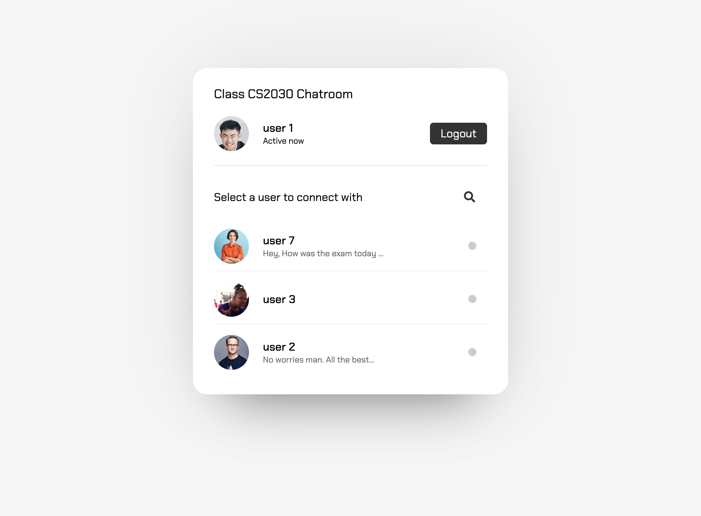
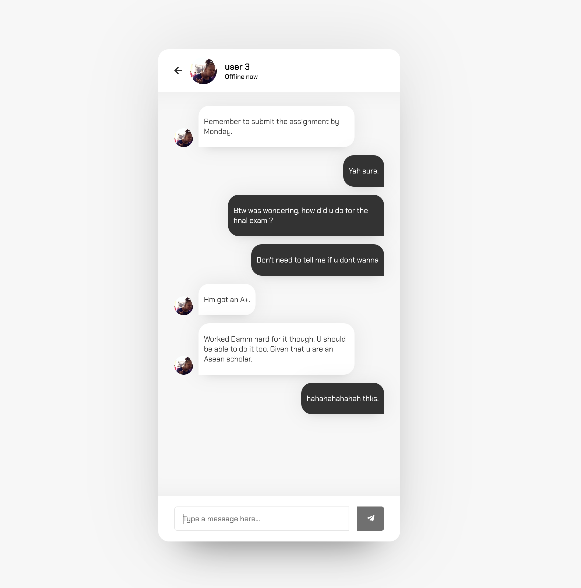

# ClassConnect

 

ClassConnect is a comprehensive web application designed to foster seamless communication and collaboration among classmates.

## Features

- **Real-time Messaging**: Implemented a real-time messaging system enabling classmates to communicate effectively.
  
- **Class Management Functionalities**: Engineered class management functionalities, allowing users to create, join, and manage class groups with ease.
  
- **Robust User Authentication**: Implemented robust user authentication mechanisms to ensure secure access and privacy.

## Technologies Used

- JavaScript
- HTML
- CSS
- PHP
- PHPAdmin
- XAMPP
- SQL

## Usage

(ClassConnect is not available for public usage.)

## Installation

To run ClassConnect locally, follow these steps:

1. Clone this repository:

   ```
   git clone https://github.com/your-username/your-repository.git
   ```

2. Navigate to the project directory:

   ```
   cd your-repository
   ```

3. Install XAMPP and set up a local server environment.

4. Import the provided SQL database into PHPMyAdmin.

5. Start the Apache and MySQL servers in XAMPP.

6. Open your browser and visit `http://localhost/your-repository` to view the application locally.
